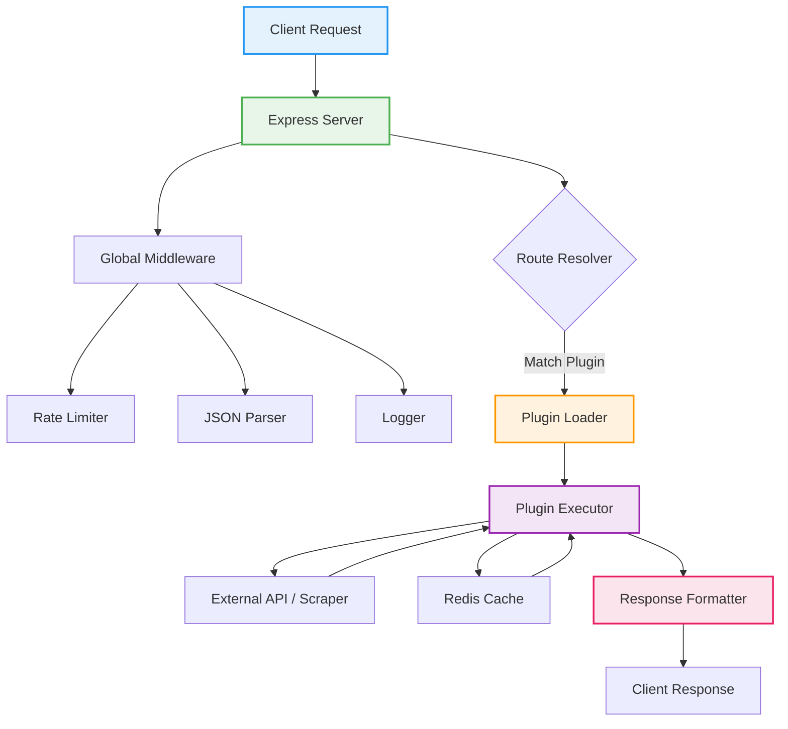

<div align="center">


# 🚀 Libie REST API

**Scalable Modular REST API Framework built with Express.js**

<p align="center">
  
  
  
  
</p>

</div>

---

## ⚡ Overview

Libie REST API adalah backend modular dengan sistem auto-loading plugin.  
Tambahkan file ke folder `plugins/` → endpoint otomatis aktif tanpa router manual.

Dirancang untuk:
- Clean architecture
- Scalability
- Maintainability
- Rapid feature expansion

---

## 🏗️ Architecture Overview



---

## 📂 Project Structure

```
.
├── server.js
├── lib/
│   ├── redis.js
│   └── iplimiter.js
├── plugins/
│   ├── ai/
│   ├── anime/
│   ├── download/
│   ├── info/
│   ├── internet/
│   ├── maker/
│   └── tool/
├── public/
└── package.json
```

---

## 🔌 Plugin System

Setiap endpoint didefinisikan sebagai module:

```js
module.exports = {
  name: "Cek Gempa",
  desc: "Informasi gempa terkini dari BMKG",
  category: "Info",
  method: "GET",
  path: "/gempa",

  async run(req, res) {
    res.status(200).json({
      status: true,
      data: {}
    });
  }
};
```

📌 File yang ditambahkan ke `plugins/` otomatis:
- Terdaftar sebagai route
- Muncul di `/api/info`
- Mengikuti format response global

---

## 📦 Global Response Format

### Success
```json
{
  "status": true,
  "data": {},
  "metadata": {
    "timestamp": "ISO-8601"
  }
}
```

### Error
```json
{
  "status": false,
  "message": "Error message",
  "error": "Detail error"
}
```

---

## 🛡 Core Features

| Feature | Description |
|----------|------------|
| Auto Plugin Loader | Tanpa router manual |
| Rate Limiting | Perlindungan basic anti-spam |
| Redis Support | Optional caching |
| Timeout Protection | External API safety |
| Structured Error | Konsisten & clean |
| Frontend Docs | UI responsif di `/` |

---

## ⚙️ Installation

```bash
npm install
```

### Run Development
```bash
npm run dev
```

### Run Production
```bash
npm start
```

Default:
```
http://localhost:3000
```

---

## 🔐 Environment Variables (Optional)

Buat file `.env`:

```
PORT=3000
REDIS_URL=redis://localhost:6379
```

---

## 📖 API Documentation

| Endpoint | Description |
|-----------|------------|
| `/` | Frontend Documentation |
| `/api/info` | JSON Endpoint List |
| `/api/:plugin` | Execute Plugin |

---

## 🚀 Design Philosophy

- Modular over monolith
- Scalable over quick hacks
- Clean code over spaghetti routes
- Structure before features

---

## 📜 License

MIT License

---

<div align="center">

Built for developers who prefer structure over chaos.


</div>