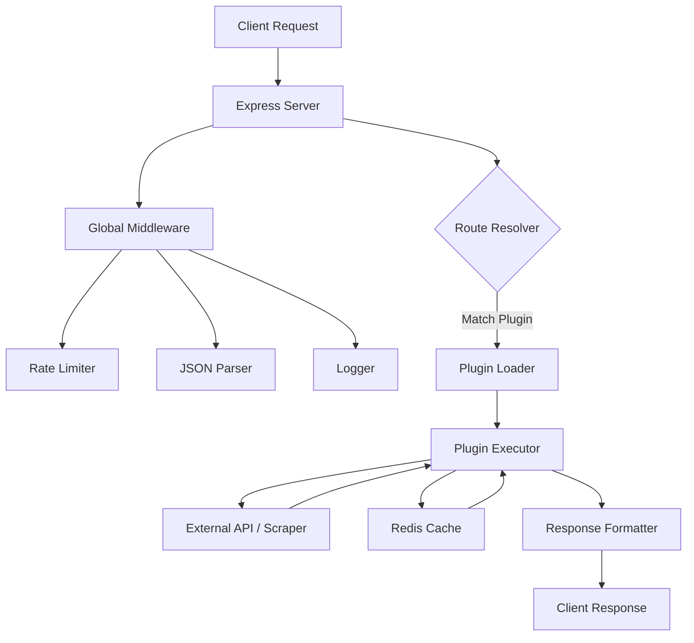

<div align="center">


<br/>


<br/>

# 🚀 Libie REST API

**Scalable Modular REST API Framework built with Express.js**

<br/>


</div>

---

## ⚡ Overview

Libie REST API adalah backend modular berbasis plugin dengan sistem auto-loading route.

Tambahkan file ke folder `plugins/` → endpoint otomatis aktif tanpa perlu registrasi router manual.

Dirancang untuk:

- Clean architecture  
- Scalability  
- Maintainability  
- Rapid feature expansion  
- Structured API responses  

---

## 🎯 Why Libie API?

Banyak backend kecil cepat berubah jadi messy karena:

- Manual route registration  
- Response format tidak konsisten  
- Tidak ada struktur modular  

Libie API menyelesaikan itu dengan:

- Auto plugin-based routing  
- Standardized global response format  
- Centralized middleware handling  
- Clean modular structure  

Framework ini cocok untuk rapid expansion tanpa mengorbankan struktur.

---

## 🏗 Architecture Overview


```mermaid
graph TD

A[Client Request] --> B[Express Server]
B --> C[Global Middleware]
C --> D[Rate Limiter]
C --> E[JSON Parser]
C --> F[Logger]

B --> G{Route Resolver}
G -->|Match Plugin| H[Plugin Loader]
H --> I[Plugin Executor]
I --> J[External API / Scraper]
I --> K[Redis Cache]

J --> I
K --> I
I --> L[Response Formatter]
L --> M[Client Response]
```

---

## 📂 Project Structure

```bash
.
├── server.js            # Entry point & server bootstrap
├── lib/                 # Core utilities
│   ├── iplimiter.js     # Rate limiting logic
│   ├── redis.js         # Redis connection handler
│   ├── scrape/
│   │   └── otakudesu.js
│   └── storage.js
├── plugins/             # Auto-loaded modular endpoints
│   ├── ai/
│   ├── anime/
│   ├── download/
│   ├── info/
│   ├── internet/
│   ├── maker/
│   └── tool/
├── public/              # Frontend documentation UI
│   ├── 404.html
│   ├── index.html
│   ├── script.js
│   └── server.html
├── save.sh              # Utility / deployment script
└── package.json
```

---

## 🔌 Plugin System

Setiap endpoint didefinisikan sebagai module:

```js
module.exports = {
  name: "Cek Gempa",
  desc: "Informasi gempa terkini dari BMKG",
  category: "Info",
  method: "GET",
  path: "/gempa",

  async run(req, res) {
    res.status(200).json({
      status: true,
      data: {}
    });
  }
};
```

File yang ditambahkan ke `plugins/` otomatis:

- Terdaftar sebagai route  
- Muncul di `/api/info`  
- Mengikuti format response global  
- Mendapat proteksi middleware  

---

## 📦 Global Response Format

### ✅ Success

```json
{
  "status": true,
  "data": {},
  "metadata": {
    "timestamp": "ISO-8601"
  }
}
```

### ❌ Error

```json
{
  "status": false,
  "message": "Error message",
  "error": "Detail error"
}
```

---

## 🔎 Example Usage

### Request

```http
GET /api/gempa
```

### Response

```json
{
  "status": true,
  "data": {
    "magnitude": 5.2,
    "location": "Indonesia"
  },
  "metadata": {
    "timestamp": "2026-03-03T12:00:00Z"
  }
}
```

---

## 🛡 Core Features

| Feature             | Description                          |
|---------------------|--------------------------------------|
| Auto Plugin Loader  | Tanpa router manual                  |
| Rate Limiting       | Basic anti-spam protection           |
| Redis Caching       | Optional performance layer           |
| Timeout Protection  | External API safety                  |
| Structured Error    | Konsisten & clean response format    |
| Frontend Docs       | UI responsif di `/`                  |

---

## ⚡ Performance Strategy

- Redis caching untuk request berulang  
- Timeout protection untuk mencegah hanging request  
- Lightweight plugin execution model  
- Standardized response structure  

---

## 🛡 Security Considerations

- Basic rate limiting  
- Structured error handling  
- Environment-based configuration  
- Timeout protection for external calls  

---

## ⚙️ Installation

```bash
git clone https://github.com/Darrma23/libie-api.git
cd libie-api
npm install
```

---

## ▶ Run Development

```bash
npm run dev
```

## ▶ Run Production

```bash
npm start
```

Default:

```
http://localhost:3000
```

---

## 🔐 Environment Variables

Buat file `.env`:

```
PORT=3000
REDIS_URL=redis://localhost:6379
```

---

## 📖 API Documentation

| Endpoint        | Description               |
|-----------------|--------------------------|
| `/`             | Frontend Documentation   |
| `/api/info`     | JSON Endpoint List       |
| `/api/:plugin`  | Execute Plugin           |

---

## 🗺 Roadmap

- [ ] JWT Authentication  
- [ ] Role-Based Access Control  
- [ ] Swagger Documentation  
- [ ] Docker Support  
- [ ] CI/CD Pipeline  
- [ ] Unit & Integration Testing  

---

## 📜 License

MIT License

---

<div align="center">

Built with structure before speed.


</div>